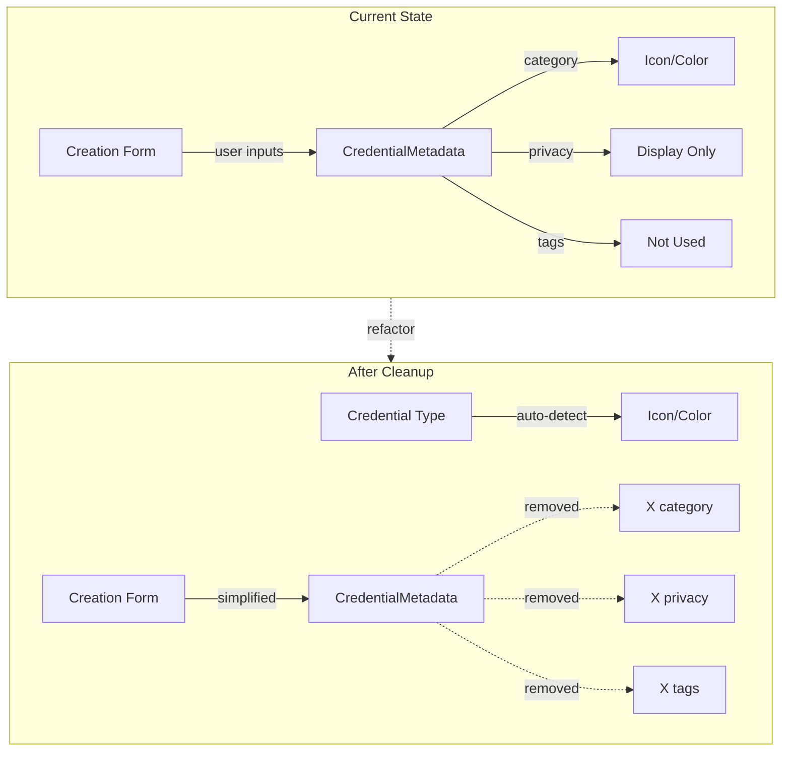

# Remove Unused Metadata Fields

## Overview

Remove `category`, `privacy`, and `tags` fields from credential metadata across the application. These fields are either non-functional (privacy), redundant (category is auto-detected from credential type), or unused (tags have no UI implementation).

## Rationale

Based on analysis:

- **Category**: Redundant for multiple reasons:
- Credentials are already grouped by **persona/DID** (different DIDs represent different life roles)
- Credential type is already stored in the `VerifiableCredential.type` array (W3C standard field)
- Category metadata duplicates information already in the credential itself
- Icon/color styling can be derived directly from credential type without needing a separate category field
- **Privacy**: Non-functional - all credentials use BBS+ signatures and encryption regardless of this setting
- **Tags**: Dead code - not displayed anywhere, no search/filter functionality exists

### Why Persona-based Grouping Makes Category Unnecessary

The application already implements credential organization through DIDs/personas:

- Users create different DIDs for different contexts (professional, academic, personal)
- Each credential is associated with a specific issuer and subject DID
- Credentials are naturally grouped by which persona they belong to
- The `VerifiableCredential.type` field already identifies what kind of credential it is (e.g., `UniversityDegreeCredential`, `ProfessionalCertificationCredential`)

## Architecture Impact




## Phase 1: Type Definitions

### Update `[src/app/core/services/credential.types.ts](src/app/core/services/credential.types.ts)`

**Remove from `CredentialMetadata` interface:**

```typescript
export interface CredentialMetadata {
  templateId?: string;
  // Remove: category?: CredentialCategory;
  // Remove: privacy?: CredentialPrivacy;
  source?: CredentialSource;
  ipfsCID?: string;
  encryptedOnIPFS?: boolean;
  nostrPointerEventId?: string;
  signatureType?: 'BbsBlsSignature2020';
  otsProof?: string;
  otsTimestamp?: number;
  bbsPublicKey?: string;
}
```

**Remove enum definitions:**

```typescript
// Remove entire CredentialCategory enum (lines ~63-75)
// Remove entire CredentialPrivacy enum (lines ~77-81)
```

**Keep `CredentialColorClass` and `CredentialIconType` enums** - these are used for UI styling based on type detection.**Update `CreateCredentialRequest` interface:**

```typescript
export interface CreateCredentialRequest {
  templateId?: string;
  issuerDID: string;
  subjectDID: string;
  credentialData: Record<string, any>;
  expirationDate?: string;
  alias?: string;
  // Remove: tags?: string[];
  // Remove: category?: CredentialCategory;
  // Remove: privacy?: CredentialPrivacy;
}
```

**Update `StoredCredential` interface:**

```typescript
export interface StoredCredential {
  credential: VerifiableCredential;
  createdAt: string;
  alias?: string;
  // Remove: tags?: string[];
  isVerified?: boolean;
  metadata?: CredentialMetadata;
}
```

## Phase 2: Service Layer Updates

### Update `[src/app/core/services/credential.service.ts](src/app/core/services/credential.service.ts)`

**Remove imports (line 8-10):**

```typescript
// Remove: CredentialCategory,
// Remove: CredentialPrivacy,
```

**Update `createCredential()` method (lines 97-111):**

```typescript
const storedCredential: StoredCredential = {
  credential,
  createdAt: new Date().toISOString(),
  alias: request.alias,
  // Remove: tags: request.tags || [],
  isVerified: false,
  metadata: {
    templateId: request.templateId,
    // Remove: category: request.category || CredentialCategory.OTHER,
    // Remove: privacy: request.privacy || CredentialPrivacy.PRIVATE,
    source: CredentialSource.SELF_ISSUED,
    signatureType: 'BbsBlsSignature2020',
    bbsPublicKey: bbsPublicKeyHex,
  },
};
```

**Update `createAndStoreEncryptedVC()` method (lines 177-191):**Apply same removals as above.**Update `importCredential()` method (lines 321-332):**

```typescript
const storedCredential: StoredCredential = {
  credential,
  createdAt: new Date().toISOString(),
  alias: alias || 'Imported Credential',
  // Remove: tags: ['imported'],
  isVerified: false,
  metadata: {
    // Remove: category: CredentialCategory.OTHER,
    // Remove: privacy: CredentialPrivacy.PRIVATE,
    source: CredentialSource.IMPORTED,
  },
};
```

**Update `_generateTestCredentials()` method (lines 415-534):**Remove `category` field from all test credential metadata objects.**Remove `getCredentialsByCategory()` method (lines 302-304):**This method is no longer needed.

## Phase 3: UI Component Updates

### Update `[src/app/pages/credentials/credential-card/credential-card.component.ts](src/app/pages/credentials/credential-card/credential-card.component.ts)`

**Remove imports:**

```typescript
// Remove: CredentialCategory,
```

**Update `getCredentialType()` method (lines 38-44):**

```typescript
getCredentialType(): string {
  const { credential, metadata } = this.credential();
  const { type } = credential;
  if (type.length > 1) {
    return type.find((t) => t !== 'VerifiableCredential') || type[0];
  }
  // Remove: return metadata?.category || 'Credential';
  return 'Credential';
}
```

**Update `getCredentialIcon()` method (lines 46-70):**

```typescript
getCredentialIcon(): string {
  // Remove: const { metadata } = this.credential();
  // Remove: const category = metadata?.category?.toLowerCase();
  const type = this.getCredentialType().toLowerCase();

  // Remove: const detectedCategory = this._getCategoryFromString(category || '') || this._getCategoryFromString(type || '');
  const detectedCategory = this._getCategoryFromString(type);

  // Rest of logic remains same
}
```

**Update `getCredentialColorClass()` method (lines 72-100):**Apply same simplification as `getCredentialIcon()` - remove category detection, only use type.**Update `getCredentialCategory()` method (lines 107-110):**

```typescript
getCredentialCategory(): string {
  // Remove: const { metadata } = this.credential();
  // Remove: return metadata?.category || this.getCredentialType();
  return this.getCredentialType();
}
```

### Update `[src/app/pages/credentials/credential-details/credential-details.component.ts](src/app/pages/credentials/credential-details/credential-details.component.ts)`

**Update `getCredentialType()` method (lines 87-96):**

```typescript
getCredentialType(): string {
  const credential = this.credential();
  if (!credential) return 'Credential';
  const { credential: cred } = credential;
  const { type } = cred;
  if (type.length > 1) {
    return type.find((t) => t !== 'VerifiableCredential') || type[0];
  }
  // Remove: const { metadata } = credential || {};
  // Remove: return metadata?.category || 'Credential';
  return 'Credential';
}
```

**Update `getIssuerCategory()` method (lines 117-125):**

```typescript
getIssuerCategory(): string {
  // Simplify - just check credential type instead of category
  const type = this.getCredentialType().toLowerCase();
  
  if (type.includes('degree') || type.includes('education') || type.includes('alumni')) {
    return 'Alumni Of';
  }
  return 'Issued By';
}
```

### Update `[src/app/pages/credentials/credential-details/credential-details.component.html](src/app/pages/credentials/credential-details/credential-details.component.html)`

**Remove category display (lines 44-51):**

```html
<!-- Remove entire block:
@if (credential()?.metadata?.category) {
  <div class="credential-details__metadata-item">
    <div class="credential-details__metadata-label">Category</div>
    <div class="credential-details__metadata-value">
      {{ credential()?.metadata?.category | titlecase }}
    </div>
  </div>
}
-->
```

**Remove privacy display (lines 52-59):**

```html
<!-- Remove entire block:
@if (credential()?.metadata?.privacy) {
  <div class="credential-details__metadata-item">
    <div class="credential-details__metadata-label">Privacy</div>
    <div class="credential-details__metadata-value">
      {{ credential()?.metadata?.privacy | titlecase }}
    </div>
  </div>
}
-->
```

## Phase 4: Form Updates

### Update `[src/app/pages/credentials/credential-create/credential-create.component.ts](src/app/pages/credentials/credential-create/credential-create.component.ts)`

**Remove imports (lines 20-21):**

```typescript
// Remove: CredentialCategory,
// Remove: CredentialPrivacy,
```

**Remove from component properties (lines 68-69):**

```typescript
// Remove: CredentialCategory = CredentialCategory;
// Remove: CredentialPrivacy = CredentialPrivacy;
```

**Update `credentialForm` definition (lines 78-84):**

```typescript
credentialForm: FormGroup = this._formBuilder.group({
  alias: ['', [Validators.required, Validators.maxLength(100)]],
  // Remove: category: [CredentialCategory.OTHER, Validators.required],
  // Remove: privacy: [CredentialPrivacy.PRIVATE, Validators.required],
  expirationDate: [''],
  // Remove: tags: [''],
});
```

**Remove `getTagsArray()` method (lines 99-105):**This method is no longer needed.**Update `createCredential()` method (lines 120-130):**

```typescript
const request: CreateCredentialRequest = {
  templateId: this.selectedTemplate()?.id,
  issuerDID: issuerValues.issuerDID,
  subjectDID: issuerValues.subjectDID,
  credentialData: dynamicValues,
  expirationDate: credentialValues.expirationDate || undefined,
  alias: credentialValues.alias,
  // Remove: tags: this.getTagsArray(),
  // Remove: category: credentialValues.category,
  // Remove: privacy: credentialValues.privacy,
};
```

### Update `[src/app/pages/credentials/credential-create/credential-create.component.html](src/app/pages/credentials/credential-create/credential-create.component.html)`

**Remove category field (lines 257-268):**

```html
<!-- Remove entire field:
<mat-form-field class="credential-create__field">
  <mat-label>Category</mat-label>
  <mat-select formControlName="category">
    <mat-option [value]="CredentialCategory.EDUCATION">Education</mat-option>
    <mat-option [value]="CredentialCategory.PROFESSIONAL">Professional</mat-option>
    <mat-option [value]="CredentialCategory.CERTIFICATION">Certification</mat-option>
    <mat-option [value]="CredentialCategory.ACHIEVEMENT">Achievement</mat-option>
    <mat-option [value]="CredentialCategory.MEMBERSHIP">Membership</mat-option>
    <mat-option [value]="CredentialCategory.PERSONAL">Personal</mat-option>
    <mat-option [value]="CredentialCategory.OTHER">Other</mat-option>
  </mat-select>
</mat-form-field>
-->
```

**Remove privacy field (lines 270-278):**

```html
<!-- Remove entire field:
<mat-form-field class="credential-create__field">
  <mat-label>Privacy</mat-label>
  <mat-select formControlName="privacy">
    <mat-option [value]="CredentialPrivacy.PRIVATE">Private</mat-option>
    <mat-option [value]="CredentialPrivacy.PUBLIC">Public</mat-option>
    <mat-option [value]="CredentialPrivacy.SELECTIVE">Selective Disclosure</mat-option>
  </mat-select>
  <mat-hint>How this credential can be shared</mat-hint>
</mat-form-field>
-->
```

**Remove tags field (lines 293-300):**

```html
<!-- Remove entire field:
<mat-form-field class="credential-create__field">
  <mat-label>Tags (Optional)</mat-label>
  <input
    matInput
    formControlName="tags"
    placeholder="blockchain, certificate, aws" />
  <mat-hint>Comma-separated tags for organizing credentials</mat-hint>
</mat-form-field>
-->
```

## Phase 5: Test Updates

### Update `[src/app/core/services/credential.service.spec.ts](src/app/core/services/credential.service.spec.ts)`

**Remove imports (lines 8-10):**

```typescript
// Remove: CredentialCategory,
// Remove: CredentialPrivacy,
```

**Update test credential requests:**Remove `category`, `privacy`, and `tags` from all `CreateCredentialRequest` test objects throughout the file.**Remove `getCredentialsByCategory()` tests (lines 420-460):**

```typescript
// Remove entire describe block:
// describe('getCredentialsByCategory()', () => { ... })
```

**Update assertions in `createCredential()` tests:**

```typescript
// Remove assertions like:
// expect(result.metadata!.category).toBe(...);
// expect(result.metadata!.privacy).toBe(...);
// expect(result.tags).toEqual(...);
```

**Update test around lines 275-292:**

```typescript
it('should set correct metadata defaults', async () => {
  const result = await service.createCredential(baseRequest);

  expect(result.metadata).toBeDefined();
  // Remove: expect(result.metadata!.category).toBe(CredentialCategory.OTHER);
  // Remove: expect(result.metadata!.privacy).toBe(CredentialPrivacy.PRIVATE);
  expect(result.metadata!.source).toBe(CredentialSource.SELF_ISSUED);
  expect(result.metadata!.templateId).toBeUndefined();
});

// Remove entire test:
// it('should use provided category and privacy', async () => { ... });
```

**Update test around lines 295-301:**

```typescript
// Remove entire test:
// it('should include tags when provided', async () => { ... });
```

**Update import test around lines 361-380:**

```typescript
it('should create imported credential with default metadata', async () => {
  const result = await service.importCredential(validCredentialJson);

  expect(result.metadata).toBeDefined();
  expect(result.metadata!.source).toBe(CredentialSource.IMPORTED);
  // Remove: expect(result.metadata!.category).toBe(CredentialCategory.OTHER);
  // Remove: expect(result.metadata!.privacy).toBe(CredentialPrivacy.PRIVATE);
  // Remove: expect(result.tags).toEqual(['imported']);
});
```

### Update Component Tests

If component test files exist for `credential-card`, `credential-details`, and `credential-create` components, update them to:

- Remove references to `category`, `privacy`, `tags`
- Update assertions that check for these fields
- Remove enum imports

## Phase 6: Backward Compatibility

Existing credentials in localStorage with `category`, `privacy`, and `tags` fields will continue to work:

- Display logic already has fallbacks that don't require these fields
- Type detection works from credential.type
- No migration needed - fields simply ignored if present

## Summary of Removals

**Type Definitions:**

- `CredentialCategory` enum
- `CredentialPrivacy` enum
- `category`, `privacy` from `CredentialMetadata`
- `tags` from `StoredCredential`
- `category`, `privacy`, `tags` from `CreateCredentialRequest`

**Service Methods:**

- `getCredentialsByCategory()`
- `getTagsArray()` (in component)

**Form Fields:**

- Category dropdown
- Privacy dropdown  
- Tags input

**Display Elements:**

- Category metadata display
- Privacy metadata display

**Files Modified:**

- `credential.types.ts`
- `credential.service.ts`
- `credential.service.spec.ts`
- `credential-create.component.ts`
- `credential-create.component.html`
- `credential-card.component.ts`
- `credential-details.component.ts`
- `credential-details.component.html`

